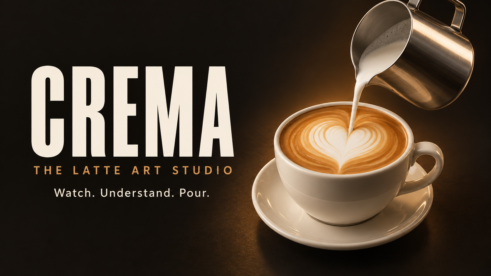

[](https://crema-barista-studio.netlify.app/)

# Crema — Latte Art Studio

A dark, warmly lit Night School interface around an interactive Three.js studio with guided heart, tulip, rosetta, heart-in-a-heart and clover pours. Choose a lesson using its finished-shape thumbnail, change camera angles, pause or scrub the demonstration, and use quarter-speed or half-speed playback. Lessons have four or five stages, individual timing and a shared preparation guide.

[Live studio](https://crema-barista-studio.netlify.app) · [GitHub repository](https://github.com/SafaElmali/crema-barista-studio)

## Run locally

Serve `dist` with a static server, for example:

```sh
python3 -m http.server 4334 --bind 127.0.0.1 --directory dist
```

Open http://127.0.0.1:4334/. The site has no compilation step, account requirement for local use, or third-party runtime asset requests.

## Deploy to Netlify

Netlify is connected to this GitHub repository. Pushes to `main` publish the production site; pull requests receive deploy previews. `netlify.toml` configures the `dist` publishing directory and runs the animation clearance tests before a repository build. The project has no package dependencies. For a manual deployment from a linked checkout, run `netlify deploy --prod --dir dist`. The original owner-private Sites deployment is independent of Netlify.

## Model and teaching approach

The cup, saucer and double-walled spouted pitcher are original procedural geometry. The renderer uses image-based lighting, physical materials, a dynamic horizontal coffee surface fitted to the tilted cup, a clipped milk plane inside the pitcher, and a stream joined to the spout. The evolving latte pattern and pitcher share a deterministic clock, so seeking works in either direction.

The foam patterns are illustrative, time-driven surface textures. The nested heart separates two pours before a shared finishing stroke. The clover places three heart-shaped leaves with closed-flow transitions and a final stem. Their drawing progress and pitcher movements share the same timeline, including backward seeking.

This is a guided demonstration of technique, not a fluid-dynamics simulation or a substitute for coached practice. Timings are for learning. A professionally filmed or physically simulated pour and review by a latte-art instructor would be appropriate for a production training course.

The page exposes two feature-detected WebMCP tools (`select_latte_art`, `control_latte_tutorial`) using the same actions as its visible controls. Unsupported browsers retain the full interface. Animation starts only on request; camera views, lesson controls and the modal guide are keyboard-accessible. A WebGL failure retains the written lessons.

## Files

- `dist/index.html`: interface, metadata and preparation guide
- `dist/style.css`: responsive layout and typography
- `dist/app.js`: lesson content and player state
- `dist/scene.js`: model, lighting, cameras and pouring motion
- `dist/art.js`: deterministic foam pattern diagrams and thumbnails
- `dist/motion.js`: continuous pouring choreography, safe approach and retreat paths
- `dist/vessel-geometry.js`: vessel meshes shared by the scene and clearance checks

Run `node --test tests/motion.test.mjs` to check the pitcher against the ceramic profile and liquid surface at 1,601 times per lesson, and verify continuity at phase boundaries. The pitcher stays close to the liquid while its body tips clear of the rim. Entry and exit lift vertically before moving across the cup.

## Credits and references

- Three.js 0.179.1 and addons: MIT, notice in `dist/vendor/THREE-LICENSE.txt`.
- Studio Small 08 by Sergej Majboroda, Poly Haven: https://polyhaven.com/a/studio_small_08, CC0. Reused from the existing Object Lab assets.
- Barlow Condensed, Playfair Display and DM Sans: Google Fonts, SIL Open Font License notices in `dist/assets/`.
- Heart technique: https://www.lamarzocco.com/uk/en/how-to-pour-latte-art/
- Drawing height and flow: https://www.baristahustle.com/lesson/b1-5-02-the-second-half/
- Heart, tulip and rosetta progression: https://www.onlinebaristatraining.com/resources/latte-art-for-beginners-how-to-pour-a-heart-tulip-rosetta/
- Directional cuts for clover-like designs: https://www.baristahustle.com/lesson/la-2-07-more-advanced-brush-strokes/
- Heart-in-a-heart lesson progression: https://www.baristahustle.com/course/latte-art/

Lesson prose is an original concise explanation, with sources linked in the preparation guide. The site is not affiliated with these educators.
